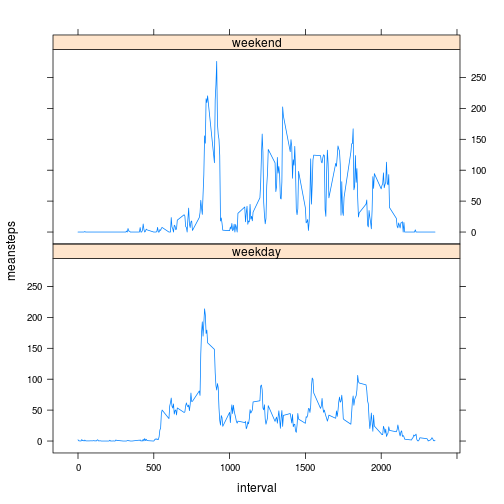

Reproducible Research: Peer Assessment 1
=========================================================

# Loading and preprocessing the data

```r
data <- read.csv("activity.csv")
data$date <- as.Date(data$date, "%Y-%m-%d")
completecases <- data[complete.cases(data), ]
```


# What is mean total number of steps taken per day?
## Histogram of total number of steps per day

```r
stepsperday <- aggregate(completecases$steps, by = list(completecases$date), 
    FUN = sum)
names(stepsperday) <- c("Day", "Steps taken")
# print(stepsperday)
hist(stepsperday$"Steps taken", main = "Histogram of the total number of steps per day", 
    xlab = "Steps")
```

 


## Mean and median per day

```r
meanperday <- aggregate(completecases$steps, by = list(completecases$date), 
    FUN = mean)
medianperday <- aggregate(completecases$steps, by = list(completecases$date), 
    FUN = median)
res <- data.frame(meanperday, medianperday$x)
names(res) <- c("Day", "Mean per day", "Median per day")
print(res, row.names = FALSE)
```

```
##         Day Mean per day Median per day
##  2012-10-02       0.4375              0
##  2012-10-03      39.4167              0
##  2012-10-04      42.0694              0
##  2012-10-05      46.1597              0
##  2012-10-06      53.5417              0
##  2012-10-07      38.2465              0
##  2012-10-09      44.4826              0
##  2012-10-10      34.3750              0
##  2012-10-11      35.7778              0
##  2012-10-12      60.3542              0
##  2012-10-13      43.1458              0
##  2012-10-14      52.4236              0
##  2012-10-15      35.2049              0
##  2012-10-16      52.3750              0
##  2012-10-17      46.7083              0
##  2012-10-18      34.9167              0
##  2012-10-19      41.0729              0
##  2012-10-20      36.0938              0
##  2012-10-21      30.6285              0
##  2012-10-22      46.7361              0
##  2012-10-23      30.9653              0
##  2012-10-24      29.0104              0
##  2012-10-25       8.6528              0
##  2012-10-26      23.5347              0
##  2012-10-27      35.1354              0
##  2012-10-28      39.7847              0
##  2012-10-29      17.4236              0
##  2012-10-30      34.0938              0
##  2012-10-31      53.5208              0
##  2012-11-02      36.8056              0
##  2012-11-03      36.7049              0
##  2012-11-05      36.2465              0
##  2012-11-06      28.9375              0
##  2012-11-07      44.7326              0
##  2012-11-08      11.1771              0
##  2012-11-11      43.7778              0
##  2012-11-12      37.3785              0
##  2012-11-13      25.4722              0
##  2012-11-15       0.1424              0
##  2012-11-16      18.8924              0
##  2012-11-17      49.7882              0
##  2012-11-18      52.4653              0
##  2012-11-19      30.6979              0
##  2012-11-20      15.5278              0
##  2012-11-21      44.3993              0
##  2012-11-22      70.9271              0
##  2012-11-23      73.5903              0
##  2012-11-24      50.2708              0
##  2012-11-25      41.0903              0
##  2012-11-26      38.7569              0
##  2012-11-27      47.3819              0
##  2012-11-28      35.3576              0
##  2012-11-29      24.4688              0
```


# What is the average daily activity pattern?
## Activity plot

```r
meanperinterval <- aggregate(completecases$steps, by = list(completecases$interval), 
    FUN = mean)
plot.default(meanperinterval$Group.1, meanperinterval$x, type = "l", xlab = "Interval", 
    ylab = "Average number of steps")
```

 


# Maximun activity interval

```r
res <- meanperinterval[which.max(meanperinterval$x), ]
names(res) <- c("Interval", "Steps")
print(res, row.names = FALSE)
```

```
##  Interval Steps
##       835 206.2
```


# Imputing missing values
## Total number of missing values

```r
sum(is.na(data))
```

```
## [1] 2304
```


## Filling the missing values
To fill the missing values we will use the mean of the interval across all days.

```r
imputate = function(i) meanperinterval[which(meanperinterval$Group.1 == i), 
    "x"]

# Creating a new data set with with the imputed values
newdata <- data
newdata[is.na(data$steps), "steps"] <- sapply(data[is.na(data$steps), "interval"], 
    imputate)

# Repeating activity pattern analysis with the imputed data
completecases <- newdata
```


## Repeateating the previous analysis
### Histogram of total number of steps per day with imputated values

```r
stepsperday <- aggregate(completecases$steps, by = list(completecases$date), 
    FUN = sum)
names(stepsperday) <- c("Day", "Steps taken")
# print(stepsperday)
hist(stepsperday$"Steps taken", main = "Histogram of the total number of steps per day with imputated values", 
    xlab = "Steps")
```

 


### Mean and median per day with imputated values

```r
meanperday <- aggregate(completecases$steps, by = list(completecases$date), 
    FUN = mean)
medianperday <- aggregate(completecases$steps, by = list(completecases$date), 
    FUN = median)
res <- data.frame(meanperday, medianperday$x)
names(res) <- c("Day", "Mean per day", "Median per day")
print(res, row.names = FALSE)
```

```
##         Day Mean per day Median per day
##  2012-10-01      37.3826          34.11
##  2012-10-02       0.4375           0.00
##  2012-10-03      39.4167           0.00
##  2012-10-04      42.0694           0.00
##  2012-10-05      46.1597           0.00
##  2012-10-06      53.5417           0.00
##  2012-10-07      38.2465           0.00
##  2012-10-08      37.3826          34.11
##  2012-10-09      44.4826           0.00
##  2012-10-10      34.3750           0.00
##  2012-10-11      35.7778           0.00
##  2012-10-12      60.3542           0.00
##  2012-10-13      43.1458           0.00
##  2012-10-14      52.4236           0.00
##  2012-10-15      35.2049           0.00
##  2012-10-16      52.3750           0.00
##  2012-10-17      46.7083           0.00
##  2012-10-18      34.9167           0.00
##  2012-10-19      41.0729           0.00
##  2012-10-20      36.0938           0.00
##  2012-10-21      30.6285           0.00
##  2012-10-22      46.7361           0.00
##  2012-10-23      30.9653           0.00
##  2012-10-24      29.0104           0.00
##  2012-10-25       8.6528           0.00
##  2012-10-26      23.5347           0.00
##  2012-10-27      35.1354           0.00
##  2012-10-28      39.7847           0.00
##  2012-10-29      17.4236           0.00
##  2012-10-30      34.0938           0.00
##  2012-10-31      53.5208           0.00
##  2012-11-01      37.3826          34.11
##  2012-11-02      36.8056           0.00
##  2012-11-03      36.7049           0.00
##  2012-11-04      37.3826          34.11
##  2012-11-05      36.2465           0.00
##  2012-11-06      28.9375           0.00
##  2012-11-07      44.7326           0.00
##  2012-11-08      11.1771           0.00
##  2012-11-09      37.3826          34.11
##  2012-11-10      37.3826          34.11
##  2012-11-11      43.7778           0.00
##  2012-11-12      37.3785           0.00
##  2012-11-13      25.4722           0.00
##  2012-11-14      37.3826          34.11
##  2012-11-15       0.1424           0.00
##  2012-11-16      18.8924           0.00
##  2012-11-17      49.7882           0.00
##  2012-11-18      52.4653           0.00
##  2012-11-19      30.6979           0.00
##  2012-11-20      15.5278           0.00
##  2012-11-21      44.3993           0.00
##  2012-11-22      70.9271           0.00
##  2012-11-23      73.5903           0.00
##  2012-11-24      50.2708           0.00
##  2012-11-25      41.0903           0.00
##  2012-11-26      38.7569           0.00
##  2012-11-27      47.3819           0.00
##  2012-11-28      35.3576           0.00
##  2012-11-29      24.4688           0.00
##  2012-11-30      37.3826          34.11
```


## Conclusions
Using the mean of the values already present the histogram grew and the days from which all the cases where incomplete sudenly have an elevated median that seems unreasonably high in comparison with the other days.

# Are there differences in activity patterns between weekdays and weekends?

```r
library(lattice)
isweekend <- factor((as.POSIXlt(data$date)$wday == 6) | (as.POSIXlt(data$date)$wday == 
    7), labels = c("weekday", "weekend"))
data$isweekend <- isweekend
completecases <- data[complete.cases(data), ]
meanperinterval <- aggregate(completecases$steps, by = c(list(completecases$interval), 
    list(completecases$isweekend)), FUN = mean)
names(meanperinterval) <- c("interval", "isweekend", "meansteps")
xyplot(meansteps ~ interval | isweekend, data = meanperinterval, , type = "l", 
    layout = c(1, 2))
```

 


